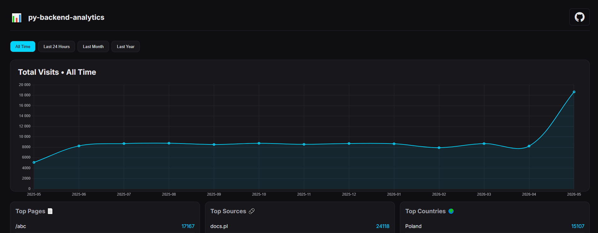

# py-backend-analytics

Easy-to-set-up python backend traffic analytics package.




---

py-backend-analytics is a package that saves data about your traffic in a DB and then lets
you easily visualize your traffic for small to medium apps.

Key features:
- Set-up-once middleware that handles all the logic
- Saving data about your traffic: location, path/page, source, datetime
- Async DB client
- out-of-the-box visualization

Currently supported frameworks:
- FastAPI

Currently supported databases:
- SQLite

## Overview flow

You specify your data using `PyBackendAnalyticsInputData` object.
Then you add the middleware. The middleware will save information about each request
in the chosen database.

Then, you can add an endpoint that will visualize this data over time.

## Future Plans

Support for Django and Postgres is planned for the future releases.

Also, improvements for the visualization layers.

## Installation

```bash
$ pip install py_backend_analytics
```

## Quickstart

```python
import uvicorn
from fastapi import FastAPI, Request, APIRouter

from py_backend_analytics import PyBackendAnalyticsInputData, PyBackendAnalyticsFastAPIMiddleware, py_backend_analytics_fastapi_visualization

app = FastAPI()
my_router = APIRouter()

# Setup py_backend_analytics
db_string = "test1.db"
input_data = PyBackendAnalyticsInputData(db_string)
app.add_middleware(PyBackendAnalyticsFastAPIMiddleware, input_data)

# Create endpoint with visualization
@my_router.get("/")
async def get(request: Request):
    # This will return HTML page that you can see at the top of this doc
    return await py_backend_analytics_fastapi_visualization(app, input_data, request)

# run the ap
app.include_router(my_router, tags=["my_router"])
uvicorn.run(app, port=8080)
```

## Usage

### Input Data

You must create a `PyBackendAnalyticsInputData` object and specify its attributes.

The only required attribute is the connection string to the DB, rest is optional.

Attributes are:
- `db_connection_string: str`
- `db_type: PyBackendAnalyticsDB` - Enum that chooses the database type, defaults to `PyBackendAnalyticsDB.SQLITE`
- `excluded_endpoints: List[str]` - list of excluded endpoints. defaults are: `["/favicon.ico", "/style.css"]`
- `excluded_path_fragments: List[str]` - excluded path fragments. defaults are: `["static", "py_backend_analytics"]`
- `excluded_path_prefixes: Set[str]` - excluded path prefixes. They will be excluded only if the path starts by them.
- `logger: Any | None` - Optional logger, used if there are any errors. Defaults to None.

DB is currently only for SQLite. It is recommended to provide an additional SQLite DB instead of the main you are using
for safety. The DB client will create a new table if it doesn't exist and one manual index.

### Middleware

Added middleware takes in the input data and no further setup is needed.

If there are any errors it will fail without raising exceptions; If logger is provided, it will try to log the error

### Visualization

You must provide your app, input_data and a request from inside the endpoint, and you will get an HTML template with the
visualization of the data in the DB.

## IP geo-location data

The geo-location data is taken from:
`db-ip.com` and uses `maxminddb` library to access it

`Under active development`
